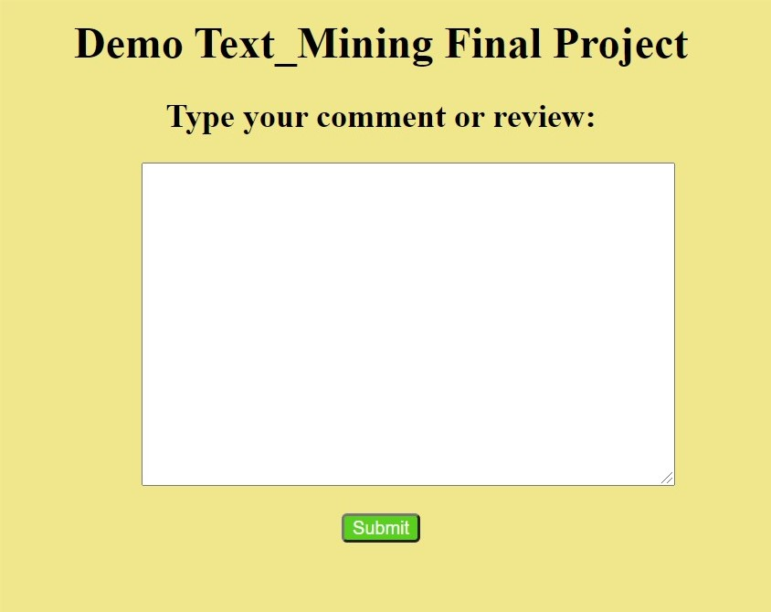

# Text-Mining-Sentiment-Analysis
Classify sentiment in a sentence into 2 general type: Possitive&Negative by Logistic Regression
## About team
We work with a team of 2 people:
* [Lâm Phát Tài](https://github.com/lamphattai2105)
* [Lâm Hoàng Khánh](https://github.com/lhk1234)
> Feel free to contact us for any further contribution 👍🤘🤗😜
## Usage
1. Clone this git and open visualize.py in src folder.
2. Run that file by [**PyCharm**](https://www.jetbrains.com/pycharm/) (if you've installed), if not run this
```
python visualize.py
```
3. It'll be in a webpage, very simple and easy to try.

4. Have fun
