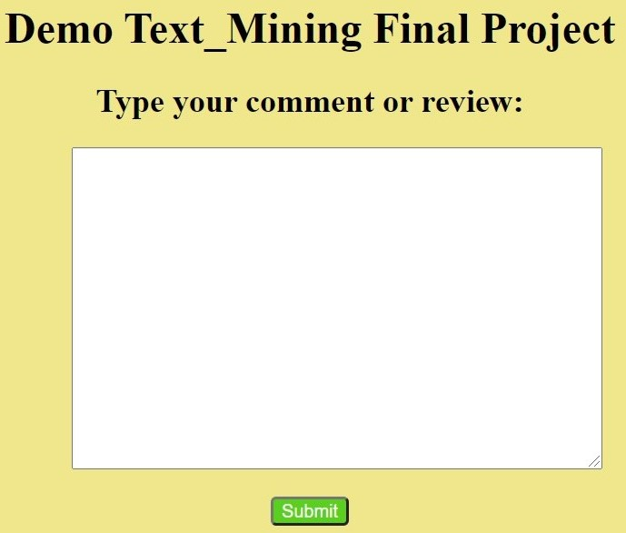

# Text-Mining-Sentiment-Analysis
> Lâm Hoàng Khánh & Lâm Phát Tài
## Usage
1. Clone this git and open visualize.py in src folder.
2. Run that file by [**PyCharm**](https://www.jetbrains.com/pycharm/) (if you've installed), if not run this
```
python visualize.py
```
3. It'll be in a webpage, very simple and easy to try.

4. Have fun
